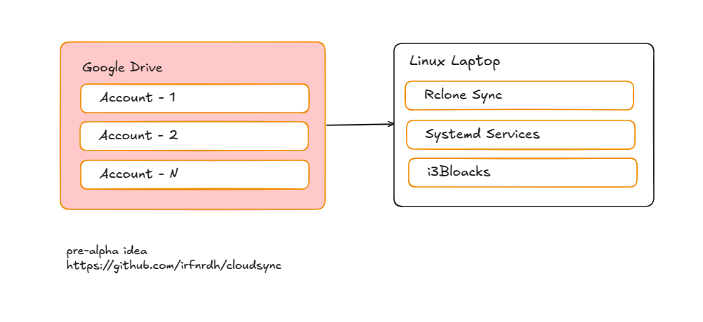

# cloudsync
Based RClone for Linux Manjaro i3wm


## Setup

```
sudo pacman -S rclone fuse zenity xclip xdg-utils
yay -S rclone-browser  # Optional GUI
rclone config
mkdir -p ~/Cloud/gdrive{1,2,3}
```

## Services
```
chmod +x mount_manager.sh
systemctl --user enable cloudsync@gdrive1.service
```

## File Manager

```
rclone link gdrive1:/path/to/file | xclip -sel clip
[ ! -d "$MOUNT_PATH" ] && mkdir -p "$MOUNT_PATH"
```

### Debug

```
rclone mount -vv --vfs-cache-mode full gdrive1: ~/Cloud/gdrive1
journalctl --user-unit cloudsync@gdrive1.service  -f # Cek log service
lsblk  # Cek mount points
rclone ls gdrive1:  # Test koneksi
sudo usermod -aG fuse $USER
rclone rc core/stats
```


### Alternatif 
- [Rclone Browser](https://github.com/kapitainsky/RcloneBrowser)
